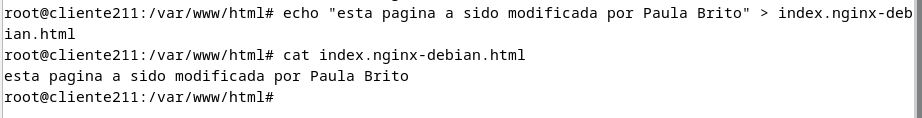
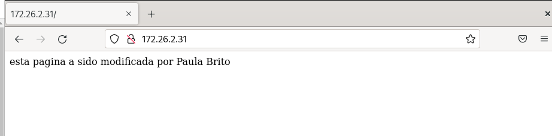

## a) Versión de Nginx instalado.
Version 1.22.1-9
## b) Ficheros de configuración.
- Modificar pagina por defecto

var/www/html/index.nginx-debian.html

## c) Página web por defecto:

Modifica la página web que lanza por defecto y personalízala.

## d) Virtual Hosting:
Queremos que nuestro servidor web ofrezca balanceo de carga desde https  a dos sitios web que tengan también https.
 
Instalamos certbot para obtener un certificado ssl
- apt update
- apt install certbot
- apt install openssl
- creamos nuestros certificados para los dos sitios web
openssl req -x509 -nodes -days 365 -newkey rsa:2048 -keyout /etc/ssl/private/sitio1.key -out /etc/ssl/certs/sitio1.crt

openssl req \
> -x509 \
> -nodes \
> -days 365 \
> -newkey rsa:2048 \
> -keyout /etc/ssl/private/sitio2.key \
> -out /etc/ssl/certs/sitio2.crt
Creamos dos archivos con la configuracion de nuestros sitios web
> server {
    listen 443 ssl;
    server_name sitio1.com;

    ssl_certificate /etc/ssl/certs/sitio1.crt;
    ssl_certificate_key /etc/ssl/private/sitio1.key;

    # Configuraciones adicionales según tus necesidades

    location / {
        proxy_pass http://backend1;
        # Opciones de proxy según tus necesidades
    }
}

server {
    listen 443 ssl;
    server_name sitio2.com;

    ssl_certificate /etc/ssl/certs/sitio2.crt;
    ssl_certificate_key /etc/ssl/private/sitio2.key;

    # Configuraciones adicionales según tus necesidades

    location / {
        proxy_pass http://backend2;
        # Opciones de proxy según tus necesidades
    }
}
Archivo de balanceo de carga con los dos sitios web
  GNU nano 7.2                     /etc/nginx/sites-available/balanceo                               
upstream backend1 {
    server sitio1-172.26.2.32:443;
}

upstream backend2 {
    server sitio2-172.26.2.33:443;
}

server {
    listen 443 ssl;
    server_name loadbalancer.com;

    # Configuraciones adicionales según tus necesidades

    location / {
        proxy_pass http://backend1;
        # Opciones de proxy según tus necesidades
        proxy_next_upstream error timeout invalid_header http_500 http_502 http_503 http_504;
    }

    location /second-site/ {
        proxy_pass http://backend2;
        # Opciones de proxy según tus necesidades
        proxy_next_upstream error timeout invalid_header http_500 http_502 http_503 http_504;
    }
}

Creamos enlaces simbolicos para habilitar los sitios

sudo ln -s /etc/nginx/sites-available/sitio1 /etc/nginx/sites-enabled/

sudo ln -s /etc/nginx/sites-available/sitio2 /etc/nginx/sites-enabled/

sudo ln -s /etc/nginx/sites-available/balanceo /etc/nginx/sites-enabled/

